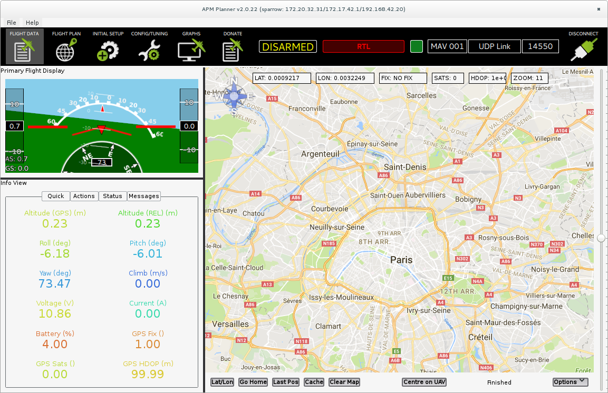
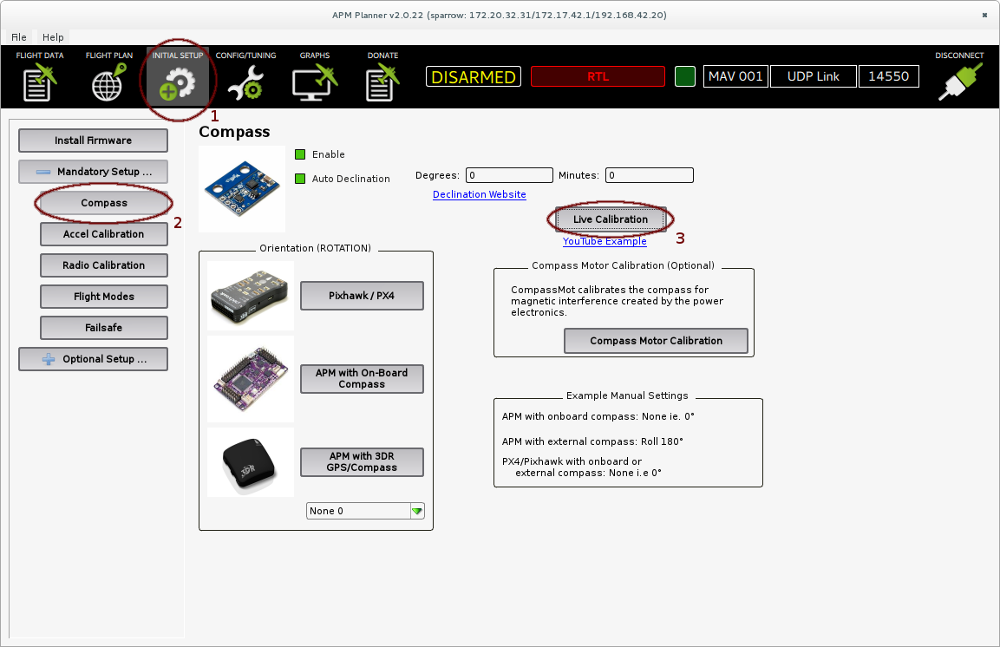
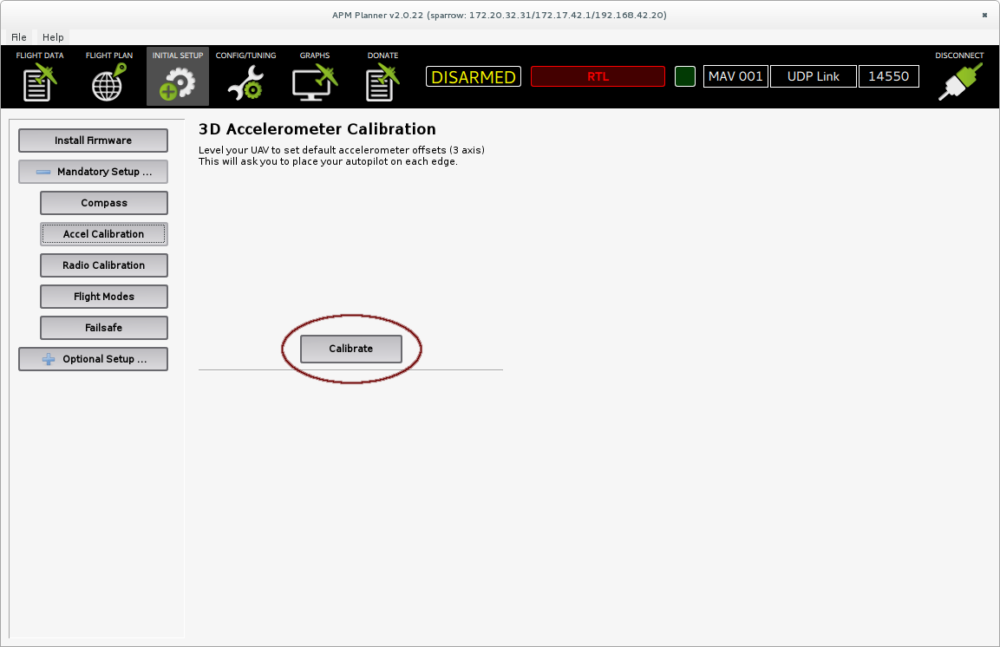

# APM Planner quick start guide for Disco

## Overview

This documentation explains how to configure basically ArduPlane on C.H.U.C.K.,
the autopilot board used in the Parrot Disco, using APM Planner 2 as the ground
control station.

This documentation comes in the markdown format, it is best viewed with a
markdown viewer.
Use extensions like *Markdown Viewer* for Mozilla Firefox, or
*Markdown Preview Plus* for Google Chrome to view it directly in your browser.
Command-line users can do:

        pandoc -s doc/apm_planner2_quick_start_guide.md | lynx -stdin

## Installation

Please refer to the [official instructions][apm_planner] for installation on
your platform. But see the [Troobleshooting](#troobleshooting) section if you
are using Debian 8, or ubuntu 14.04.

## Connection

2 ways are available to connect with a APM Planner to C.H.U.C.K..
The recommended one is via WiFi, this way, you can hope keeping the link during
your flight.
C.H.U.C.K. will create a DISCO-XXXXXX WiFi hotspot, connect to it like any other
WiFi network.

The other way is via USB, double-press the power button, a short
pattern will play and C.H.U.C.K. will reenumerate itself as an usb network
interface.
Your OS should configure the connection via DHCP automatically.
But accelerometers and compass calibration will be harder to do with a wire.

## ArduPlane startup

Triple-press the power button. The stock autopilot will be killed and ArduPlane
will be started.

**Notes:**

 * subsequent presses will restart ArduPlane, not the original autopilot
 * the switch is not persistent for now, on restart, C.H.U.C.K. will use the
 stock autopilot

## Initial setup

Launch APM Planner 2, it should connect automatically to C.H.U.C.K..

### Compass calibration

**Important:** This must be done with the hatch in place as it alters the
measured magnetic field.

Go to **INITIAL SETUP**, select **Mandatory Setup ... / Compass** and click on
**Live Calibration**.
Follow the instructions to perform the calibration.

### Accelerometer Calibration

Go to **INITIAL SETUP**, select **Mandatory Setup ... / Accel Calibration** and
**Calibrate**.
Follow the instructions to perform the calibration.

**Note:** The calibration will start only when the aircraft is strictly not
moving (i.e. not hold in the hands).

Once the calibration is finished, ArduPlane needs to be restarted.
You can do so by doing a triple press on C.H.U.C.K.'s button.

### Flight Modes

By selecting the **Flight Modes** in the **Mandatory Setup ...** menu, you can
choose which mode is assigned to which position of the mode selector channel.
For a first approach, we suggest you to fly in *fly by wire A* mode (FBWA) and
to have *rtl* and *loiter* modes quickly accessible for an easy "backup" switch
while in flight.

### Default channels list

Counting from 1, by default the RC is configured in Mode 2.

| Channel | Function       |
|---------|----------------|
| 1       | roll           |
| 2       | pitch          |
| 3       | throttle       |
| 4       | yaw            |
| 5       | mode selection |

## How to fly

1. Switch back to the **FLIGHT DATA** tab.

2. Put ArduPlane in *FBWA* mode.

3. Put the throttle axit to it's minimum and the yaw to it's maximum and
maintaining this position during 3 seconds, ArduPlane should be armed.
You can disarm by putting yaw to it's min and throttle to it's min too, during
3 seconds too.

4. Put throttle to it's maximum and pitch to go up

5. Throw the Disco

## See also

The [ArduPlane website][arduplane_website] with the official documentation.

The [Parrot Disco specific setup guide][disco_setup_guide].

## Troobleshooting

The provided .deb file doesn't install because of dependency issues.

A solution to this problem is to build APM Planner manually.

### Installation for debian Jessie (8 - stable)

First, as root:

        apt-get update
        apt-get install qt5-qmake qt5-default qtscript5-dev libqt5webkit5-dev \
            libqt5serialport5-dev  libqt5svg5-dev qml-module-qtquick2 \
            libsdl1.2-dev  libsndfile-dev flite1-dev libssl-dev libudev-dev \
            libsdl2-dev git make g++

Then as a normal user:

        git clone https://github.com/diydrones/apm_planner
        cd apm_planner
        git checkout e35fc42
        qmake qgroundcontrol.pro
        make -j5

Note that tags above 2.0.21 excluded don't build on debian 8, but the 2.0.21 tag
itself segfaults. Hence the direct use of a sha1.

### Installation for Ubuntu trusty tahr (14.04, previous LTS)

First, as root:

        add-apt-repository ppa:beineri/opt-qt561-trusty
        apt-get update
        apt-get install qt56base qt56svg qt56xmlpatterns qt56declarative \
            qt56quickcontrols2 qt56quickcontrols qt56webchannel qt56x11extras \
            qt56websockets qt56webengine qt56graphicaleffects qt56imageformats \
            qt56connectivity qt56canvas3d qt56location qt56serialport \
            qt56script qt56sensors qt56multimedia qt56wayland qt563d qt56tools \
            qt56translations qt56doc qt56-meta-full qt56-meta-minimal qt56qbs \
            qt56creator qt56creator-doc qt56serialbus libsdl1.2-dev \
            libsndfile-dev flite1-dev libssl-dev libudev-dev libsdl2-dev git \
            make g++

Then, as a normal user:

        git checkout 2.0.24
        /opt/qt56/bin/qmake apm_planner.pro
        make -j5

### All distributions

Then you can launch APM Planner 2 with:

        ./release/apmplanner2

[apm_planner]:http://ardupilot.com/planner2/index.html
[arduplane_website]:http://ardupilot.org/plane/index.html
[disco_setup_guide]:http://ardupilot.org/plane/docs/airframe-disco.html
